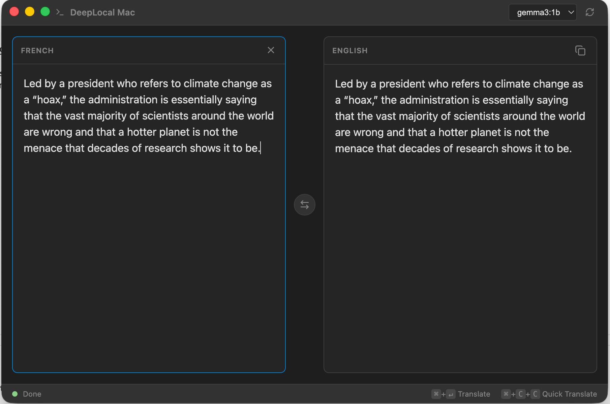

# DeepLocal for Mac 

An offline, privacy-focused translator for macOS, powered by [Ollama](https://ollama.com).
Based on the original [DeepLocal for Windows](https://github.com/ShinRalexis/DeepLocal).



## Features
- **Offline Translation**: Runs entirely on your machine using local LLMs (Llama 3, Mistral, Gemma, etc.).
- **Global Hotkey:** Hold `Command` and tap `C` twice (`Cmd+C+C`) to copy text and translate it instantly.
- **Auto-Hide**: The window automatically disappears when you click anywhere else (like Spotlight).
- **Stealth Mode**: Runs silently in the background with **no Dock icon** and **no App Switcher** entries.
- **Always Ready**: Automatically launches at login (minimized) so it's always there when you need it.
- **Privacy First**: No data leaves your computer.

## Installation

1.  **Install Ollama**: Download from [ollama.com](https://ollama.com).
2.  **Pull a Model**: Run `ollama run gemma2:9b` (or your preferred model) in Terminal.
3.  **Download DeepLocal**: Look in the [Releases](../../releases) section for the latest `.dmg` (v1.0.0).
4.  **Grant Permissions**: On first launch, grant Accessibility permissions when prompted (required for the hotkey to work).

## Development

### Prerequisites
- Node.js & npm
- Swift compiler (installed globally on macOS)
- Ollama running locally

### Setup
```bash
git clone https://github.com/YOUR_USERNAME/DeepLocal-Mac.git
cd DeepLocal-Mac
npm install
```

### Run Locally
```bash
npm run dev
```

### Build for Production
```bash
npm run build
```
This will compile the Swift sidecar and package the Electron app into a `.dmg` in `dist/`.

## License
MIT

## Credits
This project was built with **Antigravity** 🚀 and several AI models.
